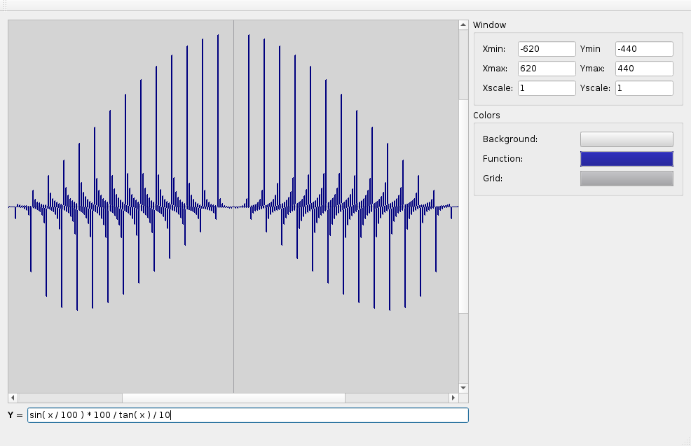

# graphing-calc

graphing-calc is a simple graphing calculator app written in c++/Qt

It has a built-in lexer, parser, and interpreter which can take an expression, and dynamically generate a callable function from it at runtime. The function is in the form of y=mx+b, and is used to plot a graph in the window.

